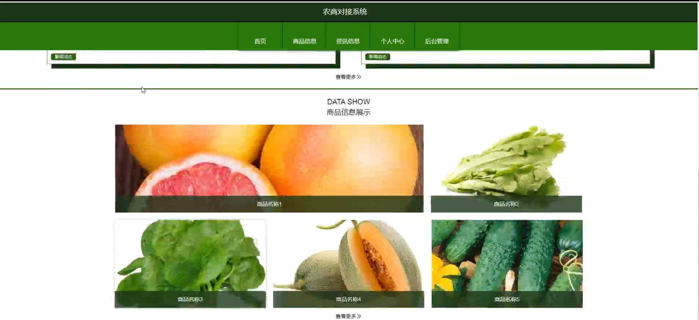
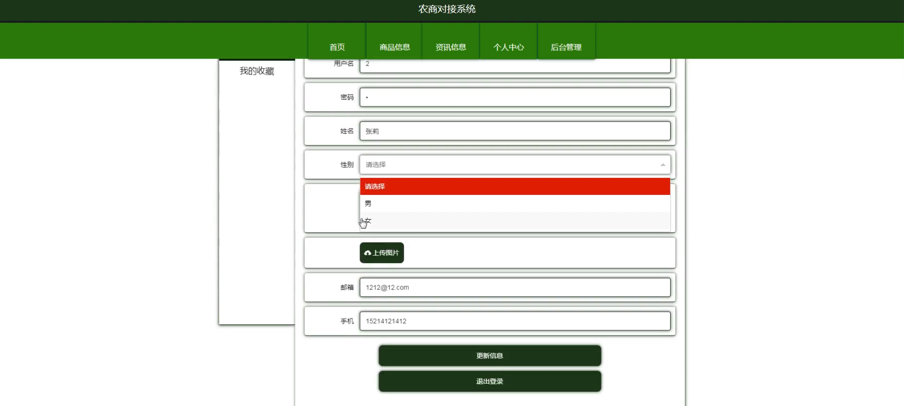
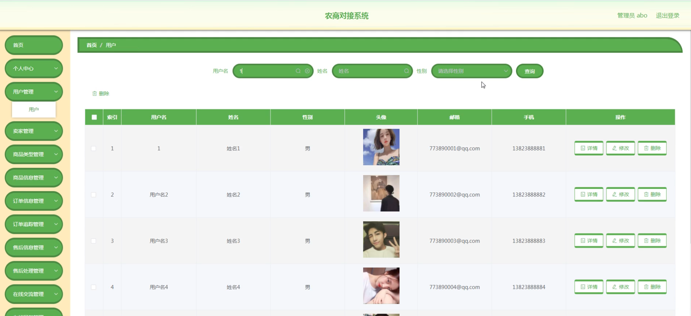
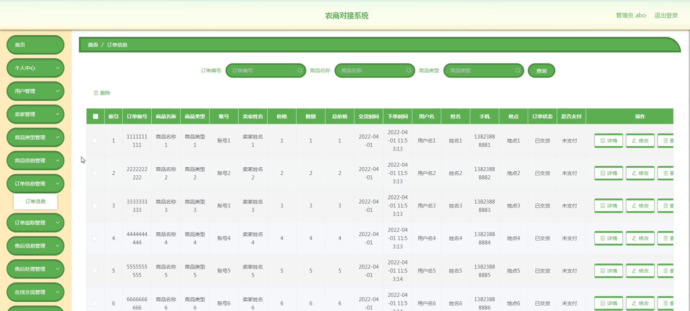
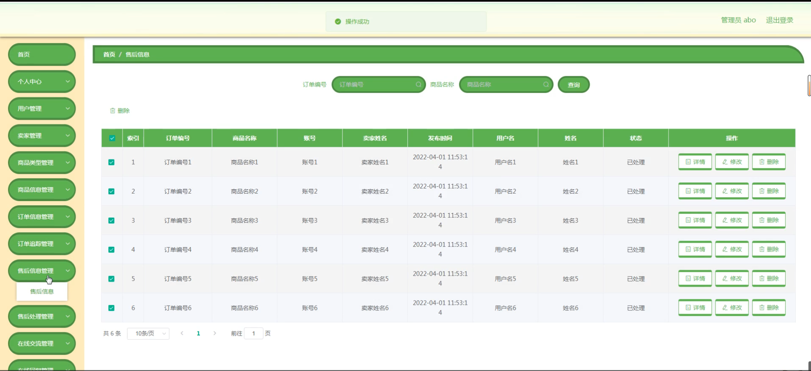
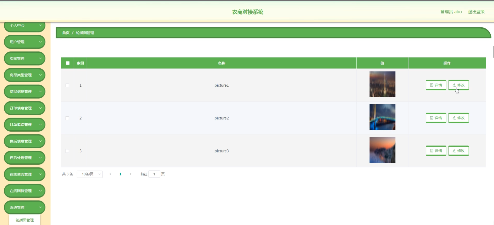
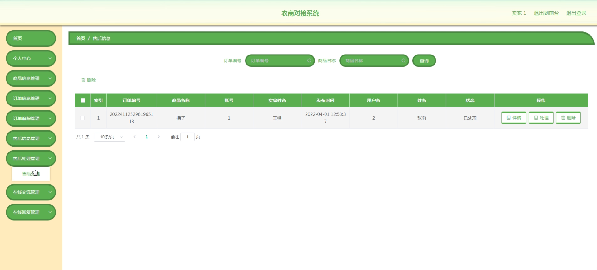

# 基于SpringBoot的农商对接系统-毕业优秀作品

---
### 👉作者QQ ：1556708905 微信：zheng0123Long (支持定制修改、部署调试、定制毕设)

### 👉接网站建设、小程序、H5、APP、各种系统等

---

#### 介绍

基于SpringBoot的农商对接系统，旨在构建一个高效、便捷、透明的农产品交易与服务平台，连接农户（卖家）、消费者（用户）以及管理平台，促进农业产业链上下游的紧密合作与信息共享。该系统充分利用了SpringBoot框架的快速开发、灵活部署及高可用性特点，结合现代互联网技术，实现了从农产品生产到消费的全链条信息化管理，有效解决了传统农业市场中信息不对称、交易效率低、售后服务缺失等问题。

#### 研究背景

随着互联网的普及和电子商务的迅猛发展，农业领域也迎来了数字化转型的浪潮。然而，传统农业市场仍面临诸多挑战，如农产品流通环节多、信息不对称导致价格波动大、农户销售渠道有限、消费者难以获取优质农产品等。此外，农产品交易过程中的质量控制、物流配送、售后服务等环节也亟待优化。因此，开发一套集商品展示、交易管理、订单追踪、售后服务于一体的农商对接系统显得尤为重要。该系统不仅能够提升农产品交易的效率和透明度，还能增强消费者信任，促进农业可持续发展。

#### 技术栈

后端技术栈：Springboot+Mysql+Maven

前端技术栈：Vue+Html+Css+Javascript+ElementUI

开发工具：Idea+Vscode+Navicate

#### 系统功能介绍

管理端  
个人中心：管理员登录后，可查看个人基本信息及操作日志，进行密码修改等设置。  
用户管理：负责用户账号的注册审核、权限分配、信息维护等，确保系统安全。  
卖家管理：对入驻商家进行资质审核、店铺管理、信用评级等，保障商品质量。  
商品类型管理：定义并管理商品分类，便于用户搜索和筛选。  
商品信息管理：上传、编辑、下架商品信息，包括图片、价格、描述等。  
订单信息管理：查看所有订单详情，包括订单状态、支付情况、物流信息等。  
订单追踪管理：实时跟踪订单物流状态，提供可视化界面。  
售后信息管理：接收并处理用户提交的售后申请，记录处理进度。  
售后处理管理：对售后问题进行分类处理，如退换货、补偿等。  
在线交流管理：提供客服系统与用户、卖家沟通的平台，解决交易中的问题。  
在线回复管理：管理客服回复内容，确保快速响应客户需求。  
系统管理：配置系统参数、监控运行状态、进行系统维护等。  

卖家端  
卖家端功能主要集中在商品与订单管理上，确保卖家能够有效运营店铺。具体包括：

商品信息：上传新商品、编辑现有商品信息、管理库存等。  
资讯信息：发布店铺公告、促销活动等，吸引用户关注。  
个人中心：查看店铺运营数据、修改店铺信息、管理员工账号等。  
后台管理：涵盖商品信息管理、订单信息管理、订单追踪、售后信息及处理管理、在线交流与回复等功能，与管理端相似但权限受限。  

用户端  
用户端设计注重用户体验，提供便捷的购物与售后服务：

商品信息：浏览商品列表、搜索商品、查看商品详情及评价。  
资讯信息：查看促销信息、店铺公告等，获取最新优惠。  
个人中心：管理个人信息、收货地址、查看订单历史、积分等。  
后台管理（有限权限）：用户主要进行订单信息管理、订单追踪、售后申请及查看处理进度等，通过在线交流与卖家或客服沟通。  

#### 系统作用

提升交易效率：通过线上平台，简化交易流程，缩短交易周期。  
增强信息透明度：实时更新商品、订单、物流信息，保障交易双方知情权。  
优化售后服务：建立标准化售后处理流程，提升用户满意度。  
促进农业产业升级：推动农业与互联网深度融合，助力农业现代化发展。  
增强市场竞争力：为农户提供更多销售渠道，为消费者提供更多选择，增强市场竞争力。  

#### 系统功能截图

登录

资讯信息

商品信息

个人中心

用户管理

订单信息管理

售后信息管理

系统管理

用户端在线回复管理

卖家端售后处理管理

#### 总结

基于SpringBoot的农商对接系统，通过整合管理端、卖家端和用户端的功能模块，构建了一个全面、高效的农产品交易与服务平台。该系统不仅解决了传统农业市场中的信息不对称、交易效率低等问题，还通过优化售后服务、提升用户体验等方式，促进了农业产业的转型升级和可持续发展。未来，随着技术的不断进步和市场的不断变化，该系统将持续迭代升级，为农业领域带来更多创新与发展机遇。

#### 使用说明

创建数据库，执行数据库脚本 修改jdbc数据库连接参数 下载安装maven依赖jar 启动idea中的springboot项目

后台登录页面
http://localhost:8080/zhinnegxiaofeijizhang/admin/dist/index.html

管理员				账户:admin 		密码：admin
用户				账户:a1 		密码：123456
